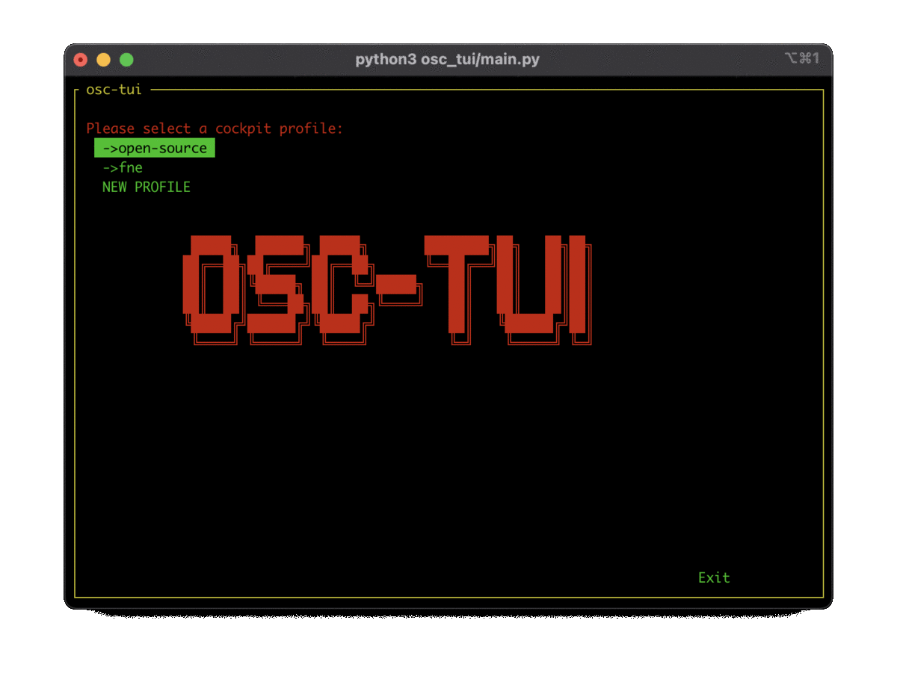

# osc-tui
[](https://docs.outscale.com/en/userguide/Open-Source-Projects.html)



# Description (╯°□°)╯︵ ┻━┻

Designed to be a POC of a Outscale's Cockpit inside the terminal using curses.<br/>The officially supported python version is currently 3.<br/> The code is currently a bit dirty... Maybe big changes are coming!<br>To refresh any table, press [F5].<br>Feel free to suggest oher architectures, libs...<br/>The `src/` folder contains the project's sources.<br/>The ```tests/``` folder contain some crappy code used to test API calls or any other things...

# Options
* `--help`: show help
* `--profile [PROFILE]`: auto-choose the profile, and skip selection screen, just list all profiles if no profile pass as argument
* `--mode MODE`: jump directly to a mode (like Vms, Images, Security...)
* `--ascii-logo`: use ascii logo, instead of UTF one.

# Costum Rules

osc-tui support some very simple "costum rule" store in `~/.osc/osc-tui-rules.json`

Examples:
```json
{
    "Val de heim": {
	"mode": "SECURITY-RULES",
	"ports": [2456, 2457],
	"protocols": ["udp", "tcp"]
    },
    "Mie raft": {
	"mode": "SECURITY-RULES",
	"ports": [25565],
	"protocols": ["udp", "tcp"]
    },
    "ssh ips": {
        "mode": "SECURITY-RULES",
        "ips": ["41.41.41.41", "43.43.43.43"],
        "ports": [25565],
        "protocols": ["udp", "tcp"]
    }

}
```

Will add 3 options `Val de heim`, `Mie raft` and `ssh ips` to the SECURITY-RULES menu.
when `Val de heim` or `Mie raft` menu are click, osc-tui will ask for an IP, and allow each protocols for each ports describe in "ports" and in "protocols"
with `ssh ips` is click osc-tui will automatically open the port 25565 for udp and tcp for "41.41.41.41" and "43.43.43.43" IPs. 

# Installation

You can either use pip on macos/windows/linux, the appimage in release, or the AUR on Arch Linux

# Running the client.

## If installed:

* `osc-tui`

## If not installed (for devs):

Move to the osc-tui folder, then run:

* `python3 -m venv env`
* `source env/bin/activate`to activate the virtual env.
* `pip install -e .`
* then just call `osc-tui`

Then you can deactivate the virtual env:

* `deactivate`

# Packaging the app with pip (BETA, WIP).

build and install the package:<br>

* `python3 setup.py build install`

# Distributions Package

## Arch Linux
```
yay -Sy osc-tui-git # you can replace yay by any AUR helper, like paru
```

# Contributing

## Just a few rules:<br>
* Format correctly your code (you can do `autopep8 --in-place --aggressive --aggressive osc_tui/*.py`).
* Add external dependencies as less as possible.

## Release plan:
Release are time base, up to now, we had no release plan, from now on, we will release a new version every 3 month, if there is any commits. 

if a major security issue happen, we'll backport the patch and create an update of old version with an updated revision. 

## when release a new version:
* update VERSION in osc_tui/main.py and setup.py
* update automatic_release_tag in .github/workflows/make_release_bins.yml (note having to do this is a bug and could be simplify)
* VERSION format is time base, 2 first numbers are for years, 2 next one are for month, and 2 last are for revisions
* push a tag at the current version, a runner should build the appimage.
